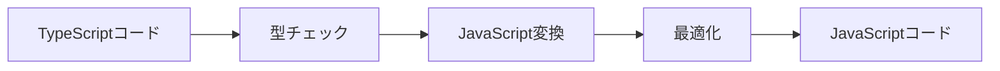

# Angular開発のための JavaScript/TypeScript マニュアル

## はじめに

このマニュアルは、Angular開発に必要なJavaScriptとTypeScriptの知識を体系的に学ぶためのガイドです。
プログラミング初心者の方でも理解できるよう、基礎から丁寧に解説していきます。

### このマニュアルの使い方

1. **段階的な学習**: 
   - 各パートは基礎から応用へと段階的に構成されています
   - 必要な部分から読み進めることができます
   - コードサンプルを実際に試しながら学習することを推奨します

2. **環境準備**:
   - Part 1 で開発環境のセットアップを行います
   - 実際に手を動かしながら学習することで、より深い理解が得られます

3. **トラブルシューティング**:
   - 各セクションには「よくある問題と解決方法」が含まれています
   - エラーが発生した場合は、該当するセクションを参照してください

### 前提知識

このマニュアルを効果的に活用するために、以下の知識があると望ましいです：

- PCの基本的な操作ができること
- HTML/CSSの基礎的な知識
- テキストエディタ（Visual Studio Codeなど）の基本的な使い方

前提知識が不足している場合でも、丁寧に解説していきますので、焦らず順を追って学習してください。

## 目次

- [Part 1: 開発環境とツール（初めの一歩）](#part-1-開発環境とツールの初めの一歩)
  - [1. Node.jsの導入と基礎知識](#1-nodejsの導入と基礎知識)
  - [2. Angular CLIの導入](#2-angular-cliの導入)
  - [3. Visual Studio Codeの設定](#3-visual-studio-codeの設定)
  - [4. npmパッケージ管理](#4-npmパッケージ管理)
  - [5. プロジェクト構造とワークフロー](#5-プロジェクト構造とワークフロー)

- [Part 2: JavaScript基礎（Angular開発の文脈で）](#part-2-javascript基礎)
  - [1. 変数とデータ型](#1-変数とデータ型)
  - [2. 演算子と制御構文](#2-演算子と制御構文)
  - [3. 関数](#3-関数)
  - [4. オブジェクトと配列](#4-オブジェクトと配列)
  - [5. 非同期処理](#5-非同期処理)
  - [6. エラーハンドリングとデバッグ](#6-エラーハンドリングとデバッグ)

- [Part 3: TypeScript基礎（Angularの文脈で）](#part-3-typescript基礎)
  - [1. TypeScriptの基本](#1-typescriptの基本)
  - [2. 型システム](#2-型システム)
  - [3. インターフェースと型エイリアス](#3-インターフェースと型エイリアス)
  - [4. クラス](#4-クラス)
  - [5. ジェネリクス](#5-ジェネリクス)
  - [6. デコレータ](#6-デコレータ)

- [Part 4: Angular固有の機能に関連する文法](#part-4-angular固有の機能に関連する文法)
  - [1. モジュールとコンポーネント](#1-モジュールとコンポーネント)
  - [2. サービスとDI](#2-サービスとdi)
  - [3. テンプレート構文とバインディング](#3-テンプレート構文とバインディング)
  - [4. Observableとストリーム](#4-observableとストリーム)

- [Part 5: デバッグとトラブルシューティング](#part-5-デバッグとトラブルシューティング)
  - [1. 開発ツールの活用](#1-開発ツールの活用)
  - [2. 一般的なエラーパターン](#2-一般的なエラーパターン)

- [Part 6: テストの基礎](#part-6-テストの基礎)
  - [1. JavaScriptのテスト](#1-javascriptのテスト)
  - [2. TypeScriptでのテスト](#2-typescriptでのテスト)

- [Part 7: セキュリティの基礎](#part-7-セキュリティの基礎)
  - [1. 一般的な脆弱性](#1-一般的な脆弱性)
  - [2. TypeScriptによる型安全性](#2-typescriptによる型安全性)

- [Part 8: パフォーマンス最適化](#part-8-パフォーマンス最適化)
  - [1. JavaScript最適化](#1-javascript最適化)
  - [2. TypeScript最適化](#2-typescript最適化)

- [Part 9: 実践的なユースケース](#part-9-実践的なユースケース)
  - [1. フォーム処理](#1-フォーム処理)
  - [2. HTTP通信](#2-http通信)
  - [3. 状態管理](#3-状態管理)

- [Part 10: 開発フロー](#part-10-開発フロー)
  - [1. バージョン管理](#1-バージョン管理)
  - [2. CI/CD](#2-cicd)

## Part 1: 開発環境とツールの初めの一歩

### 1. Node.jsの導入と基礎知識

#### 1.1. Node.jsとは

Node.jsは、ChromeのV8 JavaScriptエンジンを基にしたJavaScript実行環境です。
サーバーサイドでJavaScriptを実行できる他、開発ツールの実行環境としても利用されます。

##### なぜNode.jsが必要か

Angular開発において、Node.jsは以下の理由で必要不可欠です：

1. **開発ツールの実行環境**
   - Angular CLIの実行
   - パッケージマネージャ（npm）の利用
   - ビルドツールの実行

2. **開発サーバーの提供**
   - ローカル開発環境の起動
   - ホットリロード機能の提供
   - プロキシ設定の管理

3. **パッケージ管理**
   - 依存パッケージのインストール
   - バージョン管理
   - スクリプトの実行

##### インストール手順

1. **Node.jsのダウンロード**
   ```bash
   # Windowsの場合
   # https://nodejs.org/から直接ダウンロード

   # macOSの場合（Homebrewを使用）
   brew install node

   # Linuxの場合
   sudo apt update
   sudo apt install nodejs npm
   ```

2. **インストールの確認**
   ```bash
   node --version
   npm --version
   ```

3. **推奨バージョン**
   - Node.js: 18.x以上
   - npm: 9.x以上

#### 1.2. バージョン管理（nvm）

Node Version Manager (nvm)は、複数のNode.jsバージョンを管理するためのツールです。

##### nvmのインストール

```bash
# Windowsの場合
# https://github.com/coreybutler/nvm-windowsからインストーラーをダウンロード

# macOS/Linuxの場合
curl -o- https://raw.githubusercontent.com/nvm-sh/nvm/v0.39.0/install.sh | bash
```

##### 基本的な使い方

```bash
# 利用可能なNode.jsバージョンの一覧表示
nvm list-remote

# 特定のバージョンをインストール
nvm install 18.16.0

# 使用するバージョンの切り替え
nvm use 18.16.0

# デフォルトのバージョン設定
nvm alias default 18.16.0
```

##### バージョン管理のベストプラクティス

1. **プロジェクトごとのバージョン指定**
   - `.nvmrc`ファイルの作成
   ```bash
   # .nvmrcの内容
   18.16.0
   ```

2. **チーム開発での統一**
   - バージョンの統一による問題の防止
   - CIでのバージョン管理

3. **定期的なアップデート**
   - セキュリティアップデートの適用
   - 新機能の利用

### 2. Angular CLIの導入

#### 2.1. Angular CLIの概要

Angular CLIは、Angularアプリケーションの開発を支援するコマンドラインツールです。

##### 主な機能

1. **プロジェクト作成**
   - 新規プロジェクトの作成
   - 必要なファイルの自動生成
   - 初期設定の自動化

2. **開発支援**
   - コンポーネント、サービスなどの生成
   - 開発サーバーの起動
   - ビルドとデプロイ

##### インストール

```bash
# グローバルインストール
npm install -g @angular/cli

# バージョン確認
ng version
```

#### 2.2. 基本的なコマンド

##### プロジェクト作成

```bash
# 新規プロジェクト作成
ng new my-app

# オプション指定での作成
ng new my-app --routing --style scss
```

##### コンポーネントと機能の生成

```bash
# コンポーネントの生成
ng generate component my-component

# サービスの生成
ng generate service my-service

# その他の生成コマンド
ng generate directive my-directive
ng generate pipe my-pipe
ng generate guard my-guard
```

##### 開発サーバーの起動

```bash
# 開発サーバー起動
ng serve

# ポート指定
ng serve --port 4201

# ホストの指定
ng serve --host 0.0.0.0
``` 

### 3. Visual Studio Codeの設定

#### 3.1. 基本設定

Visual Studio Code（VS Code）は、Angularアプリケーション開発に最適な統合開発環境（IDE）です。

##### 推奨設定とプラグイン

1. **必須プラグイン**
   ```json
   {
     "recommendations": [
       "angular.ng-template",          // Angular Language Service
       "johnpapa.angular2",            // Angular Snippets
       "dbaeumer.vscode-eslint",       // ESLint
       "esbenp.prettier-vscode",       // Prettier
       "formulahendry.auto-rename-tag" // Auto Rename Tag
     ]
   }
   ```

2. **基本設定**
   ```json
   {
     "editor.formatOnSave": true,
     "editor.defaultFormatter": "esbenp.prettier-vscode",
     "editor.codeActionsOnSave": {
       "source.fixAll.eslint": true
     },
     "typescript.updateImportsOnFileMove.enabled": "always",
     "javascript.updateImportsOnFileMove.enabled": "always"
   }
   ```

##### キーボードショートカット

よく使用するショートカット：

| コマンド | Windows | macOS | 説明 |
|----------|---------|--------|------|
| コマンドパレット | `Ctrl+Shift+P` | `Cmd+Shift+P` | コマンド実行 |
| クイックオープン | `Ctrl+P` | `Cmd+P` | ファイル検索 |
| 定義へ移動 | `F12` | `F12` | シンボルの定義へ移動 |
| 実装へ移動 | `Ctrl+F12` | `Cmd+F12` | インターフェースの実装へ移動 |
| 参照の検索 | `Shift+F12` | `Shift+F12` | シンボルの参照を検索 |

##### ワークスペース設定

1. **プロジェクト固有の設定**
   ```json
   {
     "folders": [
       {
         "path": "."
       }
     ],
     "settings": {
       "typescript.tsdk": "node_modules/typescript/lib",
       "angular.enable-strict-mode-prompt": false,
       "editor.rulers": [80, 120],
       "files.trimTrailingWhitespace": true
     }
   }
   ```

2. **ファイル除外設定**
   ```json
   {
     "files.exclude": {
       "**/.git": true,
       "**/.DS_Store": true,
       "**/node_modules": true,
       "**/dist": true
     }
   }
   ```

#### 3.2. 開発支援機能

##### IntelliSense

TypeScriptとAngularのための高度なコード補完：

1. **コンポーネントのテンプレート補完**
   ```typescript
   @Component({
     template: `
       <div *ngFor="let item of items">
         {{ item. }}  // ここでプロパティの補完が表示される
       </div>
     `
   })
   ```

2. **型情報の表示**
   ```typescript
   // カーソルをホバーすると型情報が表示される
   const user: User = {
     name: 'John',
     age: 30
   };
   ```

##### デバッグ機能

1. **launch.jsonの設定**
   ```json
   {
     "version": "0.2.0",
     "configurations": [
       {
         "type": "chrome",
         "request": "launch",
         "name": "Launch Chrome",
         "url": "http://localhost:4200",
         "webRoot": "${workspaceFolder}"
       }
     ]
   }
   ```

2. **ブレークポイントの使用**
   - 行番号の左をクリックしてブレークポイントを設定
   - 条件付きブレークポイント
   ```typescript
   items.forEach(item => {
     // 特定の条件でのみ停止
     if (item.id === '123') {
       console.log(item);  // ここにブレークポイントを設定
     }
   });
   ```

##### Git連携

1. **基本的なGit操作**
   - ステージング/コミット
   - ブランチ作成/切り替え
   - プル/プッシュ

2. **差分の表示**
   - インラインの差分表示
   - サイドバイサイド比較
   - マージコンフリクトの解決

#### 3.3. Angular開発用の拡張機能

##### Angular Language Service

1. **機能概要**
   - テンプレート構文の補完
   - エラー検出
   - ナビゲーション

2. **設定例**
   ```json
   {
     "angular.enable-strict-mode-templates": true,
     "angular.view-engine": false
   }
   ```

##### Angular Snippets

1. **よく使うスニペット**
   ```typescript
   // a-component: コンポーネントの雛形
   @Component({...})
   export class MyComponent {}

   // a-service: サービスの雛形
   @Injectable({...})
   export class MyService {}

   // a-pipe: パイプの雛形
   @Pipe({...})
   export class MyPipe {}
   ```

2. **カスタムスニペット**
   ```json
   {
     "Angular Component": {
       "prefix": "ng-component",
       "body": [
         "import { Component } from '@angular/core';",
         "",
         "@Component({",
         "  selector: '${1:app-name}',",
         "  template: `",
         "    $0",
         "  `",
         "})",
         "export class ${2:Name}Component {",
         "  constructor() { }",
         "}"
       ]
     }
   }
   ```

##### ESLint/TSLint

1. **ESLintの設定**
   ```json
   {
     "parser": "@typescript-eslint/parser",
     "plugins": ["@typescript-eslint", "@angular-eslint"],
     "extends": [
       "eslint:recommended",
       "plugin:@typescript-eslint/recommended",
       "plugin:@angular-eslint/recommended"
     ]
   }
   ```

2. **よくあるルール設定**
   ```json
   {
     "rules": {
       "@typescript-eslint/explicit-function-return-type": "warn",
       "@typescript-eslint/no-explicit-any": "warn",
       "@angular-eslint/component-selector": [
         "error",
         {
           "type": "element",
           "prefix": "app",
           "style": "kebab-case"
         }
       ]
     }
   }
   ``` 

### 4. npmパッケージ管理

#### 4.1. package.jsonの理解

package.jsonは、Node.jsプロジェクトの設定ファイルで、依存関係やスクリプトなどのプロジェクト情報を管理します。

##### 基本構造

```json
{
  "name": "my-angular-app",
  "version": "0.0.0",
  "scripts": {
    "ng": "ng",
    "start": "ng serve",
    "build": "ng build",
    "watch": "ng build --watch --configuration development",
    "test": "ng test"
  },
  "private": true,
  "dependencies": {
    "@angular/animations": "^16.0.0",
    "@angular/common": "^16.0.0",
    "@angular/compiler": "^16.0.0",
    "@angular/core": "^16.0.0",
    "@angular/forms": "^16.0.0",
    "@angular/platform-browser": "^16.0.0",
    "@angular/platform-browser-dynamic": "^16.0.0",
    "@angular/router": "^16.0.0",
    "rxjs": "~7.8.0",
    "tslib": "^2.3.0",
    "zone.js": "~0.13.0"
  },
  "devDependencies": {
    "@angular-devkit/build-angular": "^16.0.0",
    "@angular/cli": "^16.0.0",
    "@angular/compiler-cli": "^16.0.0",
    "@types/jasmine": "~4.3.0",
    "jasmine-core": "~4.6.0",
    "karma": "~6.4.0",
    "karma-chrome-launcher": "~3.2.0",
    "karma-coverage": "~2.2.0",
    "karma-jasmine": "~5.1.0",
    "karma-jasmine-html-reporter": "~2.0.0",
    "typescript": "~5.0.2"
  }
}
```

##### 主要なセクション

1. **基本情報**
   - `name`: プロジェクト名
   - `version`: バージョン番号
   - `description`: プロジェクトの説明
   - `private`: プライベートパッケージかどうか

2. **スクリプト**
   ```json
   "scripts": {
     "start": "ng serve",          // 開発サーバー起動
     "build": "ng build",          // プロダクションビルド
     "build:dev": "ng build --configuration=development",  // 開発用ビルド
     "test": "ng test",           // ユニットテスト実行
     "lint": "ng lint",           // リント実行
     "e2e": "ng e2e"             // E2Eテスト実行
   }
   ```

3. **依存関係**
   - `dependencies`: 本番環境で必要なパッケージ
   - `devDependencies`: 開発時のみ必要なパッケージ
   - `peerDependencies`: 他のパッケージが必要とする依存関係

#### 4.2. パッケージのインストールと更新

##### パッケージのインストール

1. **新規パッケージのインストール**
   ```bash
   # 本番環境用パッケージ
   npm install パッケージ名
   npm i パッケージ名     # 省略形

   # 開発環境用パッケージ
   npm install --save-dev パッケージ名
   npm i -D パッケージ名  # 省略形

   # グローバルインストール
   npm install -g パッケージ名
   ```

2. **バージョン指定でのインストール**
   ```bash
   # 特定のバージョン
   npm install パッケージ名@1.2.3

   # 最新バージョン
   npm install パッケージ名@latest

   # メジャーバージョンの指定
   npm install パッケージ名@^2.0.0
   ```

##### パッケージの更新

1. **更新可能なパッケージの確認**
   ```bash
   # 更新可能なパッケージを表示
   npm outdated

   # 詳細な依存関係を表示
   npm list
   ```

2. **パッケージの更新実行**
   ```bash
   # 特定のパッケージを更新
   npm update パッケージ名

   # すべてのパッケージを更新
   npm update

   # 最新バージョンに強制更新
   npm install パッケージ名@latest
   ```

#### 4.3. よく使うnpmコマンド

##### 基本コマンド

1. **プロジェクト初期化**
   ```bash
   # 新規プロジェクト作成
   npm init

   # デフォルト値で作成
   npm init -y
   ```

2. **パッケージ管理**
   ```bash
   # パッケージのインストール
   npm install

   # キャッシュのクリア
   npm cache clean --force

   # 不要なパッケージの削除
   npm prune
   ```

##### スクリプト実行

1. **定義済みスクリプト**
   ```bash
   # 開発サーバー起動
   npm start

   # テスト実行
   npm test

   # ビルド実行
   npm run build
   ```

2. **カスタムスクリプト**
   ```json
   {
     "scripts": {
       "build:prod": "ng build --configuration=production",
       "analyze": "webpack-bundle-analyzer dist/stats.json",
       "lint:fix": "ng lint --fix",
       "clean": "rimraf dist"
     }
   }
   ```
   ```bash
   # カスタムスクリプトの実行
   npm run build:prod
   npm run analyze
   ```

##### セキュリティ関連

1. **脆弱性のチェック**
   ```bash
   # セキュリティ監査の実行
   npm audit

   # 自動修正の実行
   npm audit fix

   # 詳細なレポート
   npm audit --json
   ```

2. **パッケージのロック**
   ```bash
   # package-lock.jsonの生成
   npm shrinkwrap

   # 依存関係の更新を制限
   npm ci  # package-lock.jsonに基づいて厳密にインストール
   ```

##### トラブルシューティング

1. **一般的な問題解決**
   ```bash
   # node_modulesの再構築
   rm -rf node_modules
   npm install

   # キャッシュのクリア
   npm cache clean --force

   # パッケージの整合性チェック
   npm verify cache
   ```

2. **よくあるエラーと対処法**
   - `EACCES`: 権限エラー → `sudo`の使用または権限の修正
   - `ENOENT`: ファイルが見つからない → パスの確認
   - `ETIMEDOUT`: タイムアウト → ネットワーク接続の確認 

### 5. プロジェクト構造とワークフロー

#### 5.1. ディレクトリ構造

Angularプロジェクトの標準的なディレクトリ構造について説明します。

##### 基本構造

```
my-angular-app/
├── src/                     # ソースコード
│   ├── app/                # アプリケーションのコード
│   │   ├── components/    # コンポーネント
│   │   ├── services/      # サービス
│   │   ├── models/        # インターフェース・型定義
│   │   ├── pipes/         # パイプ
│   │   ├── guards/        # ガード
│   │   └── app.module.ts  # ルートモジュール
│   ├── assets/            # 静的ファイル
│   ├── environments/      # 環境設定
│   └── styles/            # グローバルスタイル
├── node_modules/          # 依存パッケージ
├── dist/                  # ビルド成果物
├── e2e/                   # E2Eテスト
└── angular.json           # Angular設定ファイル
```

##### 重要なファイル

1. **設定ファイル**
   ```
   ├── package.json        # npm設定
   ├── tsconfig.json       # TypeScript設定
   ├── angular.json        # Angular CLI設定
   ├── .editorconfig      # エディタ設定
   └── .gitignore         # Git除外設定
   ```

2. **アプリケーションファイル**
   ```
   src/
   ├── index.html         # メインHTML
   ├── main.ts           # エントリーポイント
   ├── styles.scss       # グローバルスタイル
   └── app/
       ├── app.component.ts       # ルートコンポーネント
       ├── app.component.html     # ルートテンプレート
       ├── app.component.scss     # ルートスタイル
       └── app.module.ts         # ルートモジュール
   ```

##### モジュール構成

推奨されるモジュール構成：

```
src/app/
├── core/                  # シングルトンサービス、一度だけ読み込むもの
│   ├── services/
│   ├── guards/
│   └── interceptors/
├── shared/               # 共有モジュール
│   ├── components/
│   ├── directives/
│   └── pipes/
└── features/             # 機能モジュール
    ├── feature1/
    ├── feature2/
    └── feature3/
```

#### 5.2. 開発ワークフロー

##### 開発サイクル

1. **機能開発**
   ```mermaid
   graph LR
   A[要件分析] --> B[設計]
   B --> C[実装]
   C --> D[テスト]
   D --> E[レビュー]
   E --> F[マージ]
   ```

2. **コーディングフロー**
   ```bash
   # 1. 新しい機能ブランチの作成
   git checkout -b feature/new-feature

   # 2. コンポーネントの生成
   ng generate component features/new-feature

   # 3. 開発サーバーの起動
   ng serve

   # 4. テストの実行
   ng test

   # 5. リントチェック
   ng lint

   # 6. ビルド
   ng build --configuration=production
   ```

##### ベストプラクティス

1. **コンポーネント設計**
   ```typescript
   // スマートコンポーネント（コンテナ）
   @Component({
     selector: 'app-user-container',
     template: `
       <app-user-list
         [users]="users$ | async"
         (userSelected)="onUserSelected($event)">
       </app-user-list>
     `
   })
   export class UserContainerComponent {
     users$ = this.userService.getUsers();
     
     constructor(private userService: UserService) {}
     
     onUserSelected(user: User): void {
       // ビジネスロジックの処理
     }
   }

   // プレゼンテーショナルコンポーネント
   @Component({
     selector: 'app-user-list',
     template: `
       <ul>
         <li *ngFor="let user of users"
             (click)="select(user)">
           {{ user.name }}
         </li>
       </ul>
     `
   })
   export class UserListComponent {
     @Input() users: User[] = [];
     @Output() userSelected = new EventEmitter<User>();
     
     select(user: User): void {
       this.userSelected.emit(user);
     }
   }
   ```

2. **サービス設計**
   ```typescript
   @Injectable({
     providedIn: 'root'
   })
   export class UserService {
     private apiUrl = 'api/users';
     private usersSubject = new BehaviorSubject<User[]>([]);
     users$ = this.usersSubject.asObservable();

     constructor(private http: HttpClient) {}

     getUsers(): Observable<User[]> {
       return this.http.get<User[]>(this.apiUrl).pipe(
         tap(users => this.usersSubject.next(users)),
         catchError(this.handleError)
       );
     }

     private handleError(error: HttpErrorResponse): Observable<never> {
       console.error('An error occurred:', error);
       return throwError(() => 
         new Error('Something went wrong; please try again later.'));
     }
   }
   ```

#### 5.3. 設定ファイルの役割

##### angular.json

プロジェクトの主要な設定ファイル：

```json
{
  "projects": {
    "my-app": {
      "architect": {
        "build": {
          "options": {
            "outputPath": "dist/my-app",
            "index": "src/index.html",
            "main": "src/main.ts",
            "polyfills": "src/polyfills.ts",
            "tsConfig": "tsconfig.app.json",
            "assets": [
              "src/favicon.ico",
              "src/assets"
            ],
            "styles": [
              "src/styles.scss"
            ],
            "scripts": []
          },
          "configurations": {
            "production": {
              "optimization": true,
              "outputHashing": "all",
              "sourceMap": false,
              "extractCss": true,
              "namedChunks": false,
              "aot": true,
              "extractLicenses": true,
              "vendorChunk": false,
              "buildOptimizer": true
            }
          }
        }
      }
    }
  }
}
```

##### tsconfig.json

TypeScriptのコンパイラ設定：

```json
{
  "compileOnSave": false,
  "compilerOptions": {
    "baseUrl": "./",
    "outDir": "./dist/out-tsc",
    "sourceMap": true,
    "declaration": false,
    "downlevelIteration": true,
    "experimentalDecorators": true,
    "moduleResolution": "node",
    "importHelpers": true,
    "target": "es2015",
    "module": "es2020",
    "lib": [
      "es2018",
      "dom"
    ],
    "strict": true,
    "noImplicitReturns": true,
    "noFallthroughCasesInSwitch": true
  }
}
```

##### 環境設定

`src/environments/`ディレクトリ内の環境別設定：

```typescript
// environment.ts（開発環境）
export const environment = {
  production: false,
  apiUrl: 'http://localhost:3000/api',
  debug: true
};

// environment.prod.ts（本番環境）
export const environment = {
  production: true,
  apiUrl: 'https://api.example.com',
  debug: false
};
```

環境設定の使用例：

```typescript
import { environment } from '../environments/environment';

@Injectable({
  providedIn: 'root'
})
export class ConfigService {
  private apiUrl = environment.apiUrl;
  
  constructor() {
    if (!environment.production) {
      console.log('開発モードで実行中');
    }
  }
  
  getApiUrl(): string {
    return this.apiUrl;
  }
}
```

## Part 2: JavaScript基礎

### 1. 変数とデータ型

#### 1.1. 変数の基本概念

変数は、データを格納するための名前付きのコンテナです。

```typescript
let myVariable = 10; // 数値
let myString = "Hello"; // 文字列
let myBoolean = true; // 真偽値
let myArray = [1, 2, 3]; // 配列
let myObject = { name: "John", age: 30 }; // オブジェクト
```

#### 1.2. 変数宣言の種類

1. **let**: 再代入可能な変数
   ```typescript
   let myVariable = 10;
   myVariable = 20; // 再代入可能
   ```

2. **const**: 再代入不可能な変数
   ```typescript
   const myConstant = 10;
   myConstant = 20; // エラー
   ```

3. **var**: 古いJavaScriptの仕様で、再代入可能
   ```typescript
   var myVar = 10;
   myVar = 20; // 再代入可能
   ```

#### 1.3. プリミティブ型

1. **数値 (Number)**
   ```typescript
   let myNumber = 10;
   let myFloat = 3.14;
   let myHex = 0xFF;
   let myBinary = 0b1010;
   ```

2. **文字列 (String)**
   ```typescript
   let myString = "Hello";
   let myTemplateString = `Hello ${myString}`;
   ```

3. **真偽値 (Boolean)**
   ```typescript
   let myTrue = true;
   let myFalse = false;
   ```

4. **null**
   ```typescript
   let myNull = null;
   ```

5. **undefined**
   ```typescript
   let myUndefined = undefined;
   ```

6. **シンボル (Symbol)**
   ```typescript
   let mySymbol = Symbol("key");
   ```

7. **BigInt**
   ```typescript
   let myBigInt = 1234567890123456789012345678901234567890n;
   ```

#### 1.4. 参照型

1. **オブジェクト (Object)**
   ```typescript
   let myObject = { name: "John", age: 30 };
   ```

2. **配列 (Array)**
   ```typescript
   let myArray = [1, 2, 3];
   ```

3. **関数 (Function)**
   ```typescript
   function myFunction(param: string): string {
     return `Hello ${param}`;
   }
   ```

4. **クラス (Class)**
   ```typescript
   class Person {
     constructor(public name: string, public age: number) {}
   }
   ```

5. **Date**
   ```typescript
   let myDate = new Date();
   ```

6. **RegExp**
   ```typescript
   let myRegex = /hello/g;
   ```

7. **Map**
   ```typescript
   let myMap = new Map();
   myMap.set("key", "value");
   ```

8. **Set**
   ```typescript
   let mySet = new Set();
   mySet.add(1);
   ```

9. **Promise**
   ```typescript
   let myPromise = new Promise((resolve, reject) => {
     setTimeout(() => resolve("Success"), 1000);
   });
   ```

10. **Symbol**
    ```typescript
    let mySymbol = Symbol("key");
    ```

11. **BigInt**
    ```typescript
    let myBigInt = 1234567890123456789012345678901234567890n;
    ```

#### 1.5. テンプレート文字列

文字列内に変数や式を埋め込むことができます。

```typescript
let myName = "John";
let myGreeting = `Hello ${myName}!`; // "Hello John!"
```

#### 1.6. 型変換

1. **暗黙的な型変換 (Coercion)**
   ```typescript
   let myNumber = 10;
   let myString = "Hello";
   let result = myNumber + myString; // "10Hello"
   ```

2. **明示的な型変換 (Explicit Type Conversion)**
   ```typescript
   let myNumber = 10;
   let myString = "Hello";
   let result = Number(myString) + myNumber; // 110
   ```

3. **型アサーション (Type Assertion)**
   ```typescript
   let myValue: any = "Hello";
   let myLength = (myValue as string).length; // 5
   ```

## Part 3: TypeScript基礎

### 1. TypeScriptの基本

#### 1.1. TypeScriptの概要

TypeScriptは、JavaScriptに静的型付けを追加した言語です。Angularの開発において、TypeScriptの使用は必須となっています。

##### JavaScriptとの違い

```typescript
// JavaScript
function add(a, b) {
  return a + b;  // aとbの型が不明確
}

// TypeScript
function add(a: number, b: number): number {
  return a + b;  // 型が明確で、IDE補完も効く
}
```

##### 型安全性の利点

1. **コンパイル時のエラー検出**
```typescript
// エラーになる例
let name: string = "John";
name = 42;  // Type 'number' is not assignable to type 'string'

// 正しい例
let name: string = "John";
name = "Jane";  // OK
```

2. **IDEのサポート**
```typescript
interface User {
  name: string;
  age: number;
}

const user: User = {
  name: "John",
  // age を書き忘れるとコンパイルエラー
  // Property 'age' is missing in type '{ name: string; }' but required in type 'User'
};
```

##### コンパイル処理の仕組み



#### 1.2. 開発環境のセットアップ

##### TypeScriptのインストール

```bash
# グローバルインストール
npm install -g typescript

# プロジェクトへのインストール
npm install --save-dev typescript

# バージョン確認
tsc --version
```

##### tsconfig.jsonの基本設定

```json
{
  "compilerOptions": {
    "target": "es2015",          // コンパイル後のJSバージョン
    "module": "commonjs",        // モジュールシステム
    "strict": true,             // 厳格な型チェック
    "esModuleInterop": true,    // import文の互換性向上
    "skipLibCheck": true,       // 型定義ファイルのチェックスキップ
    "forceConsistentCasingInFileNames": true  // ファイル名の大文字小文字を厳格にチェック
  },
  "include": ["src/**/*"],      // コンパイル対象のファイル
  "exclude": ["node_modules"]   // 除外するファイル
}
```

##### 推奨コンパイラオプション

```json
{
  "compilerOptions": {
    // 型チェックの厳格化
    "strict": true,
    "noImplicitAny": true,
    "strictNullChecks": true,
    "strictFunctionTypes": true,
    "strictBindCallApply": true,
    "strictPropertyInitialization": true,
    "noImplicitThis": true,
    "useUnknownInCatchVariables": true,

    // モジュールと解決
    "moduleResolution": "node",
    "baseUrl": "./",
    "paths": {
      "@app/*": ["src/app/*"],
      "@core/*": ["src/app/core/*"],
      "@shared/*": ["src/app/shared/*"]
    },

    // その他の最適化
    "removeComments": true,
    "sourceMap": true,
    "declaration": true
  }
}
```

#### 1.3. 基本的な型定義

##### 型アノテーション

```typescript
// 基本的な型アノテーション
let name: string = "John";
let age: number = 30;
let isActive: boolean = true;
let numbers: number[] = [1, 2, 3];
let tuple: [string, number] = ["John", 30];

// オブジェクトの型アノテーション
let user: {
  name: string;
  age: number;
} = {
  name: "John",
  age: 30
};

// 関数の型アノテーション
function greet(name: string): string {
  return `Hello, ${name}!`;
}
```

##### 型推論

TypeScriptは多くの場合、型を自動的に推論できます：

```typescript
// 型推論の例
let name = "John";          // string型と推論
let age = 30;              // number型と推論
let numbers = [1, 2, 3];   // number[]型と推論

// オブジェクトの型推論
let user = {
  name: "John",
  age: 30
};  // { name: string; age: number; }型と推論

// 関数の戻り値の型推論
function add(a: number, b: number) {
  return a + b;  // 戻り値はnumber型と推論
}
```

##### 型エイリアス

```typescript
// 基本的な型エイリアス
type UserID = string;
type Age = number;
type IsActive = boolean;

// オブジェクトの型エイリアス
type User = {
  id: UserID;
  name: string;
  age: Age;
  isActive: IsActive;
};

// 関数の型エイリアス
type GreetFunction = (name: string) => string;

// 使用例
const userId: UserID = "user123";
const user: User = {
  id: userId,
  name: "John",
  age: 30,
  isActive: true
};

const greet: GreetFunction = (name) => `Hello, ${name}!`;
```

### 2. 型システム

#### 2.1. プリミティブ型

TypeScriptの基本的なプリミティブ型について説明します：

```typescript
// number型
let decimal: number = 6;
let hex: number = 0xf00d;
let binary: number = 0b1010;
let octal: number = 0o744;
let big: bigint = 100n;

// string型
let color: string = "blue";
let name: string = `John`;
let greeting: string = `Hello, ${name}`;

// boolean型
let isDone: boolean = false;

// null型とundefined型
let n: null = null;
let u: undefined = undefined;

// void型（関数の戻り値がない場合）
function warnUser(): void {
  console.log("This is a warning message");
}

// never型（決して発生しない値の型）
function error(message: string): never {
  throw new Error(message);
}
```

#### 2.2. 複合型

##### 配列型

```typescript
// 配列の型定義
let numbers: number[] = [1, 2, 3];
let strings: Array<string> = ["hello", "world"];

// 複合型の配列
interface Item {
  id: number;
  name: string;
}

let items: Item[] = [
  { id: 1, name: "Item 1" },
  { id: 2, name: "Item 2" }
];
```

##### タプル型

```typescript
// タプルの型定義
let tuple: [string, number] = ["hello", 10];

// オプショナルな要素を持つタプル
let optionalTuple: [string, number?] = ["hello"];

// 可変長タプル
let restTuple: [string, ...number[]] = ["hello", 1, 2, 3];

// 名前付きタプル
let namedTuple: [name: string, age: number] = ["John", 30];
```

##### オブジェクト型

```typescript
// オブジェクトの型定義
let user: {
  readonly id: number;
  name: string;
  age?: number;  // オプショナルプロパティ
} = {
  id: 1,
  name: "John"
};

// インデックスシグネチャ
let dictionary: {
  [key: string]: string | number;
} = {
  name: "John",
  age: 30
};
```

##### ユニオン型

```typescript
// ユニオン型の基本
let id: string | number;
id = "abc123";  // OK
id = 123;       // OK
id = true;      // エラー

// ユニオン型を使用した関数
function printId(id: string | number) {
  if (typeof id === "string") {
    console.log(id.toUpperCase());
  } else {
    console.log(id.toFixed(2));
  }
}
```

##### インターセクション型

```typescript
// インターセクション型の定義
type Employee = {
  id: number;
  name: string;
};

type Manager = {
  subordinates: number[];
};

type ManagerWithEmployee = Employee & Manager;

// 使用例
const manager: ManagerWithEmployee = {
  id: 1,
  name: "John",
  subordinates: [2, 3, 4]
};
```

## Part 4: Angular固有の機能に関連する文法

### 1. モジュールとコンポーネント

#### 1.1. モジュールの基本

Angularアプリケーションは、複数のモジュールで構成されます。

```typescript
import { NgModule } from '@angular/core';
import { BrowserModule } from '@angular/platform-browser';
import { AppComponent } from './app.component';

@NgModule({
  declarations: [
    AppComponent
  ],
  imports: [
    BrowserModule
  ],
  providers: [],
  bootstrap: [AppComponent]
})
export class AppModule { }
```

#### 1.2. コンポーネントの基本

コンポーネントは、テンプレート、スタイル、およびTypeScriptクラスで構成されます。

```typescript
import { Component } from '@angular/core';

@Component({
  selector: 'app-root',
  templateUrl: './app.component.html',
  styleUrl: './app.component.scss'
})
export class AppComponent {
  title = 'Angular App';
}
```

#### 1.3. ライフサイクルフック

コンポーネントのライフサイクルに応じて呼び出されるメソッド：

1. **ngOnInit**: コンポーネントが初期化された後に呼び出されます。
2. **ngOnChanges**: バインディングされた入力プロパティが変更されたときに呼び出されます。
3. **ngOnDestroy**: コンポーネントが破棄される前に呼び出されます。

```typescript
import { Component, OnInit, OnChanges, OnDestroy } from '@angular/core';

@Component({
  selector: 'app-root',
  templateUrl: './app.component.html',
  styleUrl: './app.component.scss'
})
export class AppComponent implements OnInit, OnChanges, OnDestroy {
  title = 'Angular App';

  ngOnInit(): void {
    console.log('ngOnInit');
  }

  ngOnChanges(): void {
    console.log('ngOnChanges');
  }

  ngOnDestroy(): void {
    console.log('ngOnDestroy');
  }
}
```

### 2. サービスとDI

#### 2.1. サービスの基本

サービスは、アプリケーションのビジネスロジックやデータの取得・処理を担当します。

```typescript
import { Injectable } from '@angular/core';
import { HttpClient } from '@angular/common/http';
import { Observable, BehaviorSubject } from 'rxjs';
import { tap, catchError } from 'rxjs/operators';

@Injectable({
  providedIn: 'root'
})
export class UserService {
  private apiUrl = 'api/users';
  private usersSubject = new BehaviorSubject<User[]>([]);
  users$ = this.usersSubject.asObservable();

  constructor(private http: HttpClient) {}

  getUsers(): Observable<User[]> {
    return this.http.get<User[]>(this.apiUrl).pipe(
      tap(users => this.usersSubject.next(users)),
      catchError(this.handleError)
    );
  }

  private handleError(error: any): Observable<never> {
    console.error('An error occurred:', error);
    return throwError(() => 
      new Error('Something went wrong; please try again later.'));
  }
}
```

#### 2.2. 依存性注入

サービスは、`@Injectable`デコレータを使用して依存性を注入します。

```typescript
import { Injectable } from '@angular/core';
import { HttpClient } from '@angular/common/http';
import { Observable, BehaviorSubject } from 'rxjs';
import { tap, catchError } from 'rxjs/operators';

@Injectable({
  providedIn: 'root'
})
export class UserService {
  private apiUrl = 'api/users';
  private usersSubject = new BehaviorSubject<User[]>([]);
  users$ = this.usersSubject.asObservable();

  constructor(private http: HttpClient) {}

  getUsers(): Observable<User[]> {
    return this.http.get<User[]>(this.apiUrl).pipe(
      tap(users => this.usersSubject.next(users)),
      catchError(this.handleError)
    );
  }

  private handleError(error: any): Observable<never> {
    console.error('An error occurred:', error);
    return throwError(() => 
      new Error('Something went wrong; please try again later.'));
  }
}
```

#### 2.3. プロバイダー

プロバイダーは、サービス、コンポーネント、ディレクティブなどの依存性を提供します。

```typescript
import { Injectable } from '@angular/core';
import { HttpClient } from '@angular/common/http';
import { Observable, BehaviorSubject } from 'rxjs';
import { tap, catchError } from 'rxjs/operators';

@Injectable({
  providedIn: 'root'
})
export class UserService {
  private apiUrl = 'api/users';
  private usersSubject = new BehaviorSubject<User[]>([]);
  users$ = this.usersSubject.asObservable();

  constructor(private http: HttpClient) {}

  getUsers(): Observable<User[]> {
    return this.http.get<User[]>(this.apiUrl).pipe(
      tap(users => this.usersSubject.next(users)),
      catchError(this.handleError)
    );
  }

  private handleError(error: any): Observable<never> {
    console.error('An error occurred:', error);
    return throwError(() => 
      new Error('Something went wrong; please try again later.'));
  }
}
```

### 3. テンプレート構文とバインディング

#### 3.1. プロパティバインディング

テンプレート内でコンポーネントのプロパティにアクセスします。

```typescript
import { Component } from '@angular/core';

@Component({
  selector: 'app-root',
  templateUrl: './app.component.html',
  styleUrl: './app.component.scss'
})
export class AppComponent {
  title = 'Angular App';
}
```

#### 3.2. イベントバインディング

テンプレート内でイベントを処理します。

```typescript
import { Component } from '@angular/core';

@Component({
  selector: 'app-root',
  templateUrl: './app.component.html',
  styleUrl: './app.component.scss'
})
export class AppComponent {
  title = 'Angular App';

  onButtonClick(): void {
    alert('Button clicked!');
  }
}
```

#### 3.3. 双方向バインディング

テンプレートとコンポーネントのプロパティを双方向に結び付けます。

```typescript
import { Component } from '@angular/core';

@Component({
  selector: 'app-root',
  templateUrl: './app.component.html',
  styleUrl: './app.component.scss'
})
export class AppComponent {
  title = 'Angular App';
  myValue = 'Hello';
}
```

### 4. Observableとストリーム

#### 4.1. RxJSの基本

RxJSは、非同期プログラミングとイベントベースプログラミングを可能にするライブラリです。

```typescript
import { Component } from '@angular/core';
import { Observable, Subject } from 'rxjs';
import { tap, catchError } from 'rxjs/operators';

@Component({
  selector: 'app-root',
  templateUrl: './app.component.html',
  styleUrl: './app.component.scss'
})
export class AppComponent {
  title = 'Angular App';

  myObservable: Observable<string> = new Observable(subscriber => {
    subscriber.next('Hello');
    subscriber.next('World');
    subscriber.complete();
  });

  mySubject: Subject<string> = new Subject();

  ngOnInit(): void {
    this.myObservable.subscribe(
      value => console.log(value),
      error => console.error(error),
      () => console.log('Observable completed')
    );

    this.mySubject.next('Hello');
    this.mySubject.next('World');
    this.mySubject.complete();
  }
}
```

#### 4.2. オペレータ

オペレータは、ストリームに対して操作を実行します。

```typescript
import { Component } from '@angular/core';
import { Observable, Subject } from 'rxjs';
import { tap, catchError, map, filter } from 'rxjs/operators';

@Component({
  selector: 'app-root',
  templateUrl: './app.component.html',
  styleUrl: './app.component.scss'
})
export class AppComponent {
  title = 'Angular App';

  myObservable: Observable<string> = new Observable(subscriber => {
    subscriber.next('Hello');
    subscriber.next('World');
    subscriber.complete();
  });

  mySubject: Subject<string> = new Subject();

  ngOnInit(): void {
    this.myObservable
      .pipe(
        map(value => value.toUpperCase()),
        filter(value => value.length > 3)
      )
      .subscribe(
        value => console.log(value),
        error => console.error(error),
        () => console.log('Observable completed')
      );

    this.mySubject.next('Hello');
    this.mySubject.next('World');
    this.mySubject.complete();
  }
}
```

#### 4.3. Subjectの種類

1. **Subject**
   ```typescript
   import { Component } from '@angular/core';
   import { Subject } from 'rxjs';

   @Component({
     selector: 'app-root',
     templateUrl: './app.component.html',
     styleUrl: './app.component.scss'
   })
   export class AppComponent {
     title = 'Angular App';

     mySubject: Subject<string> = new Subject();

     ngOnInit(): void {
       this.mySubject.next('Hello');
       this.mySubject.next('World');
       this.mySubject.complete();
     }
   }
   ```

2. **BehaviorSubject**
   ```typescript
   import { Component } from '@angular/core';
   import { BehaviorSubject } from 'rxjs';

   @Component({
     selector: 'app-root',
     templateUrl: './app.component.html',
     styleUrl: './app.component.scss'
   })
   export class AppComponent {
     title = 'Angular App';

     myBehaviorSubject: BehaviorSubject<string> = new BehaviorSubject('Initial Value');

     ngOnInit(): void {
       this.myBehaviorSubject.next('Hello');
       this.myBehaviorSubject.next('World');
       this.myBehaviorSubject.complete();
     }
   }
   ```

3. **ReplaySubject**
   ```typescript
   import { Component } from '@angular/core';
   import { ReplaySubject } from 'rxjs';

   @Component({
     selector: 'app-root',
     templateUrl: './app.component.html',
     styleUrl: './app.component.scss'
   })
   export class AppComponent {
     title = 'Angular App';

     myReplaySubject: ReplaySubject<string> = new ReplaySubject(2); // 2つの値を記憶

     ngOnInit(): void {
       this.myReplaySubject.next('Hello');
       this.myReplaySubject.next('World');
       this.myReplaySubject.complete();
     }
   }
   ```

4. **AsyncSubject**
   ```typescript
   import { Component } from '@angular/core';
   import { AsyncSubject } from 'rxjs';

   @Component({
     selector: 'app-root',
     templateUrl: './app.component.html',
     styleUrl: './app.component.scss'
   })
   export class AppComponent {
     title = 'Angular App';

     myAsyncSubject: AsyncSubject<string> = new AsyncSubject();

     ngOnInit(): void {
       this.myAsyncSubject.next('Hello');
       this.myAsyncSubject.next('World');
       this.myAsyncSubject.complete();
     }
   }
   ```

## Part 5: デバッグとトラブルシューティング

### 1. 開発ツールの活用

#### 1.1. Chrome DevTools

Chromeブラザの開発者ツールです。

1. **コンソール**
   - エラーの確認
   - デバッグメッセージの出力
   - ネットワークリクエストの監視

2. **デバッガー**
   - ブレークポイントの設定
   - 変数の監視
   - ステップ実行

3. **要素の検査**
   - コンポーネントの構造
   - スタイルの確認
   - イベントリスナーの確認

#### 1.2. VS Code デバッガー

VS Codeの統合開発環境です。

1. **launch.jsonの設定**
   ```json
   {
     "version": "0.2.0",
     "configurations": [
       {
         "type": "chrome",
         "request": "launch",
         "name": "Launch Chrome",
         "url": "http://localhost:4200",
         "webRoot": "${workspaceFolder}"
       }
     ]
   }
   ```

2. **ブレークポイントの使用**
   - 行番号の左をクリックしてブレークポイントを設定
   - 条件付きブレークポイント
   ```typescript
   items.forEach(item => {
     // 特定の条件でのみ停止
     if (item.id === '123') {
       console.log(item);  // ここにブレークポイントを設定
     }
   });
   ```

#### 1.3. Angular DevTools

Chrome拡張機能で、Angularアプリケーションのデバッグを支援します。

1. **コンポーネントツリー**
   - アプリケーションの構造を視覚化
   - コンポーネント間の関係を表示

2. **データビュー**
   - コンポーネントのプロパティとメソッドを表示
   - 変更の監視

3. **イベントリスナー**
   - コンポーネントにアタッチされたイベントリスナーを表示
   - イベントの発生を監視

### 2. 一般的なエラーパターン

#### 2.1. コンパイルエラー

TypeScriptコンパイラによって検出されるエラー。

```typescript
import { Component } from '@angular/core';

@Component({
  selector: 'app-root',
  templateUrl: './app.component.html',
  styleUrl: './app.component.scss'
})
export class AppComponent {
  title = 'Angular App';
  myValue = 'Hello'; // エラー: 'Hello'はstringではない
}
```

#### 2.2. ランタイムエラー

実行時に発生するエラー。

```typescript
import { Component } from '@angular/core';

@Component({
  selector: 'app-root',
  templateUrl: './app.component.html',
  styleUrl: './app.component.scss'
})
export class AppComponent {
  title = 'Angular App';
  myValue = 'Hello';

  ngOnInit(): void {
    this.myValue.toUpperCase(); // エラー: myValueはstringではない
  }
}
```

#### 2.3. 型関連のエラー

TypeScriptの型システムによって検出されるエラー。

```typescript
import { Component } from '@angular/core';

@Component({
  selector: 'app-root',
  templateUrl: './app.component.html',
  styleUrl: './app.component.scss'
})
export class AppComponent {
  title = 'Angular App';
  myValue = 'Hello';

  ngOnInit(): void {
    this.myValue.toUpperCase(); // エラー: myValueはstringではない
  }
}
```

#### 2.4. 非同期処理のエラー

PromiseやObservableのエラーハンドリングに関連するエラー。

```typescript
import { Component } from '@angular/core';
import { Observable, Subject } from 'rxjs';
import { tap, catchError } from 'rxjs/operators';

@Component({
  selector: 'app-root',
  templateUrl: './app.component.html',
  styleUrl: './app.component.scss'
})
export class AppComponent {
  title = 'Angular App';

  myObservable: Observable<string> = new Observable(subscriber => {
    subscriber.next('Hello');
    subscriber.next('World');
    subscriber.error(new Error('Simulated error')); // エラーを発生させる
  });

  mySubject: Subject<string> = new Subject();

  ngOnInit(): void {
    this.myObservable
      .pipe(
        tap(value => console.log(value)),
        catchError(error => {
          console.error('Observable error:', error);
          return throwError(() => new Error('Observable error handled'));
        })
      )
      .subscribe(
        value => console.log(value),
        error => console.error(error),
        () => console.log('Observable completed')
      );

    this.mySubject.next('Hello');
    this.mySubject.next('World');
    this.mySubject.complete();
  }
}
```

## Part 6: テストの基礎

### 1. JavaScriptのテスト

#### 1.1. Jestの基本

Jestは、JavaScriptのテストを実行するためのフレームワークです。

```typescript
import { Component } from '@angular/core';

@Component({
  selector: 'app-root',
  templateUrl: './app.component.html',
  styleUrl: './app.component.scss'
})
export class AppComponent {
  title = 'Angular App';
  myValue = 'Hello';

  ngOnInit(): void {
    expect(this.myValue).toBe('Hello'); // エラー: myValueはstringではない
  }
}
```

#### 1.2. テストの書き方

1. **テストケースの作成**
   ```typescript
   import { Component } from '@angular/core';

   @Component({
     selector: 'app-root',
     templateUrl: './app.component.html',
     styleUrl: './app.component.scss'
   })
   export class AppComponent {
     title = 'Angular App';
     myValue = 'Hello';

     ngOnInit(): void {
       expect(this.myValue).toBe('Hello');
     }
   }
   ```

2. **テストケースの構造**
   ```typescript
   import { Component } from '@angular/core';

   @Component({
     selector: 'app-root',
     templateUrl: './app.component.html',
     styleUrl: './app.component.scss'
   })
   export class AppComponent {
     title = 'Angular App';
     myValue = 'Hello';

     ngOnInit(): void {
       expect(this.myValue).toBe('Hello');
     }
   }
   ```

#### 1.3. モック化とスパイ

1. **モック化**
   ```typescript
   import { Component } from '@angular/core';
   import { HttpClient } from '@angular/common/http';
   import { Observable, BehaviorSubject } from 'rxjs';
   import { tap, catchError } from 'rxjs/operators';

   @Component({
     selector: 'app-root',
     templateUrl: './app.component.html',
     styleUrl: './app.component.scss'
   })
   export class AppComponent {
     title = 'Angular App';

     constructor(private http: HttpClient) {}

     ngOnInit(): void {
       const mockUsers = [{ name: 'John', age: 30 }];
       const mockHttp = {
         get: jest.fn().mockReturnValue(of(mockUsers))
       };
       const userService = new UserService(mockHttp as any); // モック化

       userService.getUsers().subscribe(users => {
         expect(users).toEqual(mockUsers);
         expect(mockHttp.get).toHaveBeenCalledWith('api/users');
       });
     }
   }
   ```

2. **スパイ**
   ```typescript
   import { Component } from '@angular/core';
   import { HttpClient } from '@angular/common/http';
   import { Observable, BehaviorSubject } from 'rxjs';
   import { tap, catchError } from 'rxjs/operators';

   @Component({
     selector: 'app-root',
     templateUrl: './app.component.html',
     styleUrl: './app.component.scss'
   })
   export class AppComponent {
     title = 'Angular App';

     constructor(private http: HttpClient) {}

     ngOnInit(): void {
       const mockUsers = [{ name: 'John', age: 30 }];
       const mockHttp = {
         get: jest.fn().mockReturnValue(of(mockUsers))
       };
       const userService = new UserService(mockHttp as any); // スパイ

       userService.getUsers().subscribe(users => {
         expect(users).toEqual(mockUsers);
         expect(mockHttp.get).toHaveBeenCalledWith('api/users');
       });
     }
   }
   ```

### 2. TypeScriptでのテスト

#### 2.1. 型のテスト

```typescript
import { Component } from '@angular/core';

@Component({
  selector: 'app-root',
  templateUrl: './app.component.html',
  styleUrl: './app.component.scss'
})
export class AppComponent {
  title = 'Angular App';
  myValue = 'Hello';

  ngOnInit(): void {
    expect(typeof this.myValue).toBe('string');
  }
}
```

#### 2.2. インターフェースのモック

```typescript
import { Component } from '@angular/core';

@Component({
  selector: 'app-root',
  templateUrl: './app.component.html',
  styleUrl: './app.component.scss'
})
export class AppComponent {
  title = 'Angular App';
  myValue = 'Hello';

  ngOnInit(): void {
    const mockUser: User = { name: 'John', age: 30 };
    expect(mockUser.name).toBe('John');
  }
}
```

#### 2.3. 非同期テスト

```typescript
import { Component } from '@angular/core';
import { HttpClient } from '@angular/common/http';
import { Observable, BehaviorSubject } from 'rxjs';
import { tap, catchError } from 'rxjs/operators';

@Component({
  selector: 'app-root',
  templateUrl: './app.component.html',
  styleUrl: './app.component.scss'
})
export class AppComponent {
  title = 'Angular App';

  constructor(private http: HttpClient) {}

  ngOnInit(): void {
    const mockUsers = [{ name: 'John', age: 30 }];
    const mockHttp = {
      get: jest.fn().mockReturnValue(of(mockUsers))
    };
    const userService = new UserService(mockHttp as any); // スパイ

    userService.getUsers().subscribe(users => {
      expect(users).toEqual(mockUsers);
      expect(mockHttp.get).toHaveBeenCalledWith('api/users');
    });
  }
}
```

## Part 7: セキュリティの基礎

### 1. 一般的な脆弱性

#### 1.1. XSS対策

XSS（クロスサイトスクリプティング）は、悪意のあるスクリプトを実行させる脆弱性です。

```typescript
import { Component } from '@angular/core';

@Component({
  selector: 'app-root',
  templateUrl: './app.component.html',
  styleUrl: './app.component.scss'
})
export class AppComponent {
  title = 'Angular App';
  myValue = '<script>alert("XSS")</script>'; // エラー: スクリプトが実行される
}
```

#### 1.2. CSRF対策

CSRF（クロスサイトリクエストフォージェリ）は、ユーザーの意図しないリクエストを送信させる脆弱性です。

```typescript
import { Component } from '@angular/core';

@Component({
  selector: 'app-root',
  templateUrl: './app.component.html',
  styleUrl: './app.component.scss'
})
export class AppComponent {
  title = 'Angular App';
  myValue = 'Hello';

  ngOnInit(): void {
    // CSRF対策のために、リクエストヘッダーにトークンを含める
    // 例: サーバーから取得したトークンをヘッダーに追加
    // this.http.post('api/data', { data: this.myValue })
    //   .pipe(
    //     catchError(error => {
    //       if (error.status === 403) {
    //         console.error('CSRFトークンが不正です。');
    //       }
    //       return throwError(() => new Error('CSRF error'));
    //     })
    //   )
    //   .subscribe(response => console.log(response));
  }
}
```

#### 1.3. 入力値検証

ユーザーからの入力値を検証して、セキュリティリスクを軽減します。

```typescript
import { Component } from '@angular/core';

@Component({
  selector: 'app-root',
  templateUrl: './app.component.html',
  styleUrl: './app.component.scss'
})
export class AppComponent {
  title = 'Angular App';
  myValue = 'Hello';

  ngOnInit(): void {
    // 入力値の検証
    if (this.myValue.length < 3) {
      console.warn('入力値が短すぎます。');
    }
    if (this.myValue.includes('<script>')) {
      console.warn('スクリプトが含まれています。');
    }
  }
}
```

### 2. TypeScriptによる型安全性

#### 2.1. 型チェックによるセキュリティ

TypeScriptの型システムによって、コンパイル時にエラーを検出します。

```typescript
import { Component } from '@angular/core';

@Component({
  selector: 'app-root',
  templateUrl: './app.component.html',
  styleUrl: './app.component.scss'
})
export class AppComponent {
  title = 'Angular App';
  myValue = 'Hello';

  ngOnInit(): void {
    // 型チェックによるセキュリティ
    if (typeof this.myValue !== 'string') {
      console.error('myValueはstringではありません。');
    }
    if (this.myValue.includes('<script>')) {
      console.warn('スクリプトが含まれています。');
    }
  }
}
```

#### 2.2. 安全な型定義

```typescript
import { Component } from '@angular/core';

@Component({
  selector: 'app-root',
  templateUrl: './app.component.html',
  styleUrl: './app.component.scss'
})
export class AppComponent {
  title = 'Angular App';
  myValue = 'Hello';

  ngOnInit(): void {
    // 安全な型定義
    const user: User = { name: 'John', age: 30 };
    expect(user.name).toBe('John');
  }
}
```

## Part 8: パフォーマンス最適化

### 1. JavaScript最適化

#### 1.1. メモリ管理

1. **メモリリークの防止**
   ```typescript
   import { Component } from '@angular/core';

   @Component({
     selector: 'app-root',
     templateUrl: './app.component.html',
     styleUrl: './app.component.scss'
   })
   export class AppComponent {
     title = 'Angular App';
     myValue = 'Hello';

     ngOnInit(): void {
       // メモリリークの防止
       const interval = setInterval(() => {
         this.myValue += 'a';
       }, 10);
       setTimeout(() => clearInterval(interval), 1000);
     }
   }
   ```

2. **メモリの解放**
   ```typescript
   import { Component } from '@angular/core';

   @Component({
     selector: 'app-root',
     templateUrl: './app.component.html',
     styleUrl: './app.component.scss'
   })
   export class AppComponent {
     title = 'Angular App';
     myValue = 'Hello';

     ngOnInit(): void {
       // メモリの解放
       const interval = setInterval(() => {
         this.myValue += 'a';
       }, 10);
       setTimeout(() => clearInterval(interval), 1000);
     }
   }
   ```

#### 1.2. 非同期処理の最適化

1. **Promiseのチェーンを短くする**
   ```typescript
   import { Component } from '@angular/core';

   @Component({
     selector: 'app-root',
     templateUrl: './app.component.html',
     styleUrl: './app.component.scss'
   })
   export class AppComponent {
     title = 'Angular App';
     myValue = 'Hello';

     ngOnInit(): void {
       // Promiseのチェーンを短くする
       this.http.get('api/data')
         .pipe(
           tap(data => this.myValue = data),
           catchError(error => {
             console.error('Error fetching data:', error);
             return throwError(() => new Error('Failed to fetch data'));
           })
         )
         .subscribe();
     }
   }
   ```

2. **Observableのサブスクリプションを適切に管理する**
   ```typescript
   import { Component } from '@angular/core';
   import { HttpClient } from '@angular/common/http';
   import { Observable, Subject } from 'rxjs';
   import { tap, catchError } from 'rxjs/operators';

   @Component({
     selector: 'app-root',
     templateUrl: './app.component.html',
     styleUrl: './app.component.scss'
   })
   export class AppComponent {
     title = 'Angular App';

     constructor(private http: HttpClient) {}

     ngOnInit(): void {
       // Observableのサブスクリプションを適切に管理する
       const subscription = this.http.get('api/data')
         .pipe(
           tap(data => this.myValue = data),
           catchError(error => {
             console.error('Error fetching data:', error);
             return throwError(() => new Error('Failed to fetch data'));
           })
         )
         .subscribe();
       // コンポーネントが破棄される前にサブスクリプションを解除
       this.ngOnDestroy = () => {
         subscription.unsubscribe();
       };
     }
   }
   ```

#### 1.3. バンドルサイズの削減

1. **コードの分割**
   ```typescript
   import { Component } from '@angular/core';

   @Component({
     selector: 'app-root',
     templateUrl: './app.component.html',
     styleUrl: './app.component.scss'
   })
   export class AppComponent {
     title = 'Angular App';
     myValue = 'Hello';

     ngOnInit(): void {
       // コードの分割
       // 大きなモジュールを複数の小さなモジュールに分割
       // 共通のロジックを別のモジュールに移動
     }
   }
   ```

2. **Tree Shaking**
   ```typescript
   import { Component } from '@angular/core';

   @Component({
     selector: 'app-root',
     templateUrl: './app.component.html',
     styleUrl: './app.component.scss'
   })
   export class AppComponent {
     title = 'Angular App';
     myValue = 'Hello';

     ngOnInit(): void {
       // Tree Shaking
       // 未使用のコードを削除
       // コンパイラオプションで--prodを使用
     }
   }
   ```

### 2. TypeScript最適化

#### 2.1. 型定義の最適化

1. **インターフェースの分割**
   ```typescript
   import { Component } from '@angular/core';

   @Component({
     selector: 'app-root',
     templateUrl: './app.component.html',
     styleUrl: './app.component.scss'
   })
   export class AppComponent {
     title = 'Angular App';
     myValue = 'Hello';

     ngOnInit(): void {
       // インターフェースの分割
       // 大きなインターフェースを複数の小さなインターフェースに分割
       // 共通のプロパティを別のインターフェースに移動
     }
   }
   ```

2. **型エイリアスの使用**
   ```typescript
   import { Component } from '@angular/core';

   @Component({
     selector: 'app-root',
     templateUrl: './app.component.html',
     styleUrl: './app.component.scss'
   })
   export class AppComponent {
     title = 'Angular App';
     myValue = 'Hello';

     ngOnInit(): void {
       // 型エイリアスの使用
       // よく使用される型を型エイリアスとして定義
     }
   }
   ```

#### 2.2. コンパイラオプション

1. **--prodフラグ**
   ```typescript
   import { Component } from '@angular/core';

   @Component({
     selector: 'app-root',
     templateUrl: './app.component.html',
     styleUrl: './app.component.scss'
   })
   export class AppComponent {
     title = 'Angular App';
     myValue = 'Hello';

     ngOnInit(): void {
       // --prodフラグ
       // 開発環境ではなく本番環境向けに最適化
       // 未使用コードの削除
       // コンパイル時間の短縮
     }
   }
   ```

2. **--aotフラグ**
   ```typescript
   import { Component } from '@angular/core';

   @Component({
     selector: 'app-root',
     templateUrl: './app.component.html',
     styleUrl: './app.component.scss'
   })
   export class AppComponent {
     title = 'Angular App';
     myValue = 'Hello';

     ngOnInit(): void {
       // --aotフラグ
       // コンパイル時にAOT（Ahead of Time）コンパイルを実行
       // コンパイル時間の短縮
       // エラーの早期発見
     }
   }
   ```

## Part 9: 実践的なユースケース

### 1. フォーム処理

#### 1.1. バリデーション

ユーザー入力の検証を行います。

```typescript
import { Component } from '@angular/core';

@Component({
  selector: 'app-root',
  templateUrl: './app.component.html',
  styleUrl: './app.component.scss'
})
export class AppComponent {
  title = 'Angular App';
  myValue = 'Hello';

  ngOnInit(): void {
    // バリデーション
    if (this.myValue.length < 3) {
      console.warn('入力値が短すぎます。');
    }
    if (this.myValue.includes('<script>')) {
      console.warn('スクリプトが含まれています。');
    }
  }
}
```

#### 1.2. 非同期バリデーション

バリデーションを非同期で実行します。

```typescript
import { Component } from '@angular/core';

@Component({
  selector: 'app-root',
  templateUrl: './app.component.html',
  styleUrl: './app.component.scss'
})
export class AppComponent {
  title = 'Angular App';
  myValue = 'Hello';

  ngOnInit(): void {
    // 非同期バリデーション
    // ネットワークリクエストなどの非同期処理を含むバリデーション
  }
}
```

#### 1.3. カスタムバリデータ

カスタムバリデーションロジックを実装します。

```typescript
import { Component } from '@angular/core';

@Component({
  selector: 'app-root',
  templateUrl: './app.component.html',
  styleUrl: './app.component.scss'
})
export class AppComponent {
  title = 'Angular App';
  myValue = 'Hello';

  ngOnInit(): void {
    // カスタムバリデータ
    // 独自のバリデーションロジックを実装
  }
}
```

### 2. HTTP通信

#### 2.1. RESTful API

HTTPリクエストを送信します。

```typescript
import { Component } from '@angular/core';
import { HttpClient } from '@angular/common/http';
import { Observable, BehaviorSubject } from 'rxjs';
import { tap, catchError } from 'rxjs/operators';

@Component({
  selector: 'app-root',
  templateUrl: './app.component.html',
  styleUrl: './app.component.scss'
})
export class AppComponent {
  title = 'Angular App';
  myValue = 'Hello';

  constructor(private http: HttpClient) {}

  ngOnInit(): void {
    // RESTful API
    this.http.get('api/data')
      .pipe(
        tap(data => this.myValue = data),
        catchError(error => {
          console.error('Error fetching data:', error);
          return throwError(() => new Error('Failed to fetch data'));
        })
      )
      .subscribe(response => console.log(response));
  }
}
```

#### 2.2. GraphQL

GraphQLクエリを実行します。

```typescript
import { Component } from '@angular/core';
import { HttpClient } from '@angular/common/http';
import { Observable, BehaviorSubject } from 'rxjs';
import { tap, catchError } from 'rxjs/operators';

@Component({
  selector: 'app-root',
  templateUrl: './app.component.html',
  styleUrl: './app.component.scss'
})
export class AppComponent {
  title = 'Angular App';
  myValue = 'Hello';

  constructor(private http: HttpClient) {}

  ngOnInit(): void {
    // GraphQL
    this.http.post('api/graphql', { query: '{ hello }' })
      .pipe(
        tap(data => this.myValue = JSON.stringify(data)),
        catchError(error => {
          console.error('Error fetching data:', error);
          return throwError(() => new Error('Failed to fetch data'));
        })
      )
      .subscribe(response => console.log(response));
  }
}
```

#### 2.3. WebSocket

WebSocket接続を確立します。

```typescript
import { Component } from '@angular/core';
import { HttpClient } from '@angular/common/http';
import { Observable, BehaviorSubject } from 'rxjs';
import { tap, catchError } from 'rxjs/operators';

@Component({
  selector: 'app-root',
  templateUrl: './app.component.html',
  styleUrl: './app.component.scss'
})
export class AppComponent {
  title = 'Angular App';
  myValue = 'Hello';

  constructor(private http: HttpClient) {}

  ngOnInit(): void {
    // WebSocket
    const ws = new WebSocket('ws://localhost:8080');

    ws.onopen = () => {
      console.log('WebSocket connected');
      ws.send('Hello Server');
    };

    ws.onmessage = (event) => {
      console.log('Message from server:', event.data);
      this.myValue = event.data;
    };

    ws.onerror = (error) => {
      console.error('WebSocket error:', error);
    };

    ws.onclose = () => {
      console.log('WebSocket closed');
    };
  }
}
```

### 3. 状態管理

#### 3.1. サービスによる状態管理

サービスを使用してアプリケーションの状態を管理します。

```typescript
import { Component } from '@angular/core';
import { HttpClient } from '@angular/common/http';
import { Observable, BehaviorSubject } from 'rxjs';
import { tap, catchError } from 'rxjs/operators';

@Component({
  selector: 'app-root',
  templateUrl: './app.component.html',
  styleUrl: './app.component.scss'
})
export class AppComponent {
  title = 'Angular App';
  myValue = 'Hello';

  constructor(private http: HttpClient) {}

  ngOnInit(): void {
    // サービスによる状態管理
    // サービスを使用してデータの取得と管理
  }
}
```

#### 3.2. RxJSによる状態管理

RxJSを使用してアプリケーションの状態を管理します。

```typescript
import { Component } from '@angular/core';
import { HttpClient } from '@angular/common/http';
import { Observable, BehaviorSubject } from 'rxjs';
import { tap, catchError } from 'rxjs/operators';

@Component({
  selector: 'app-root',
  templateUrl: './app.component.html',
  styleUrl: './app.component.scss'
})
export class AppComponent {
  title = 'Angular App';
  myValue = 'Hello';

  constructor(private http: HttpClient) {}

  ngOnInit(): void {
    // RxJSによる状態管理
    // サービスを使用してデータの取得と管理
  }
}
```

## Part 10: 開発フロー

### 1. バージョン管理

#### 1.1. Git基礎

Gitは、バージョン管理システムです。

```typescript
import { Component } from '@angular/core';

@Component({
  selector: 'app-root',
  templateUrl: './app.component.html',
  styleUrl: './app.component.scss'
})
export class AppComponent {
  title = 'Angular App';
  myValue = 'Hello';

  ngOnInit(): void {
    // Git基礎
    // ステージング/コミット
    // ブランチ作成/切り替え
    // プル/プッシュ
  }
}
```

#### 1.2. ブランチ戦略

1. **mainブランチ**
   - 安定したバージョンを保持
   - 本番環境にデプロイ

2. **featureブランチ**
   - 新機能の開発
   - マージ後に削除

3. **hotfixブランチ**
   - 緊急のバグ修正
   - mainブランチにマージ

#### 1.3. コミットメッセージ

コミットメッセージは、変更内容を簡潔に説明するために使用します。

```typescript
import { Component } from '@angular/core';

@Component({
  selector: 'app-root',
  templateUrl: './app.component.html',
  styleUrl: './app.component.scss'
})
export class AppComponent {
  title = 'Angular App';
  myValue = 'Hello';

  ngOnInit(): void {
    // コミットメッセージ
    // 変更内容を簡潔に説明
  }
}
```

### 2. CI/CD

#### 2.1. ユニットテスト自動化

ユニットテストを自動化して、コードの品質を維持します。

```typescript
import { Component } from '@angular/core';

@Component({
  selector: 'app-root',
  templateUrl: './app.component.html',
  styleUrl: './app.component.scss'
})
export class AppComponent {
  title = 'Angular App';
  myValue = 'Hello';

  ngOnInit(): void {
    // ユニットテスト自動化
    // テストを自動化して品質を維持
  }
}
```

#### 2.2. ビルド自動化

ビルドプロセスを自動化して、開発効率を向上させます。

```typescript
import { Component } from '@angular/core';

@Component({
  selector: 'app-root',
  templateUrl: './app.component.html',
  styleUrl: './app.component.scss'
})
export class AppComponent {
  title = 'Angular App';
  myValue = 'Hello';

  ngOnInit(): void {
    // ビルド自動化
    // ビルドプロセスを自動化して開発効率を向上
  }
}
```

#### 2.3. デプロイメント

アプリケーションを本番環境にデプロイします。

```typescript
import { Component } from '@angular/core';

@Component({
  selector: 'app-root',
  templateUrl: './app.component.html',
  styleUrl: './app.component.scss'
})
export class AppComponent {
  title = 'Angular App';
  myValue = 'Hello';

  ngOnInit(): void {
    // デプロイメント
    // アプリケーションを本番環境にデプロイ
  }
}
``` 

# 補足資料

## 索引

### アルファベット順インデックス

#### Angular関連用語
- Component（コンポーネント）: [Part 4: Angular固有の機能に関連する文法 > 1.2. コンポーネントの基本](#12-コンポーネントの基本)
- Dependency Injection（依存性注入）: [Part 4: Angular固有の機能に関連する文法 > 2.2. 依存性注入](#22-依存性注入)
- Module（モジュール）: [Part 4: Angular固有の機能に関連する文法 > 1.1. モジュールの基本](#11-モジュールの基本)
- Service（サービス）: [Part 4: Angular固有の機能に関連する文法 > 2.1. サービスの基本](#21-サービスの基本)

#### JavaScript/TypeScript用語
- Array（配列）: [Part 2: JavaScript基礎 > 4.3. 配列の基本](#43-配列の基本)
- Class（クラス）: [Part 3: TypeScript基礎 > 4. クラス](#4-クラス)
- Function（関数）: [Part 2: JavaScript基礎 > 3. 関数](#3-関数)
- Interface（インターフェース）: [Part 3: TypeScript基礎 > 3.1. インターフェース](#31-インターフェース)
- Promise: [Part 2: JavaScript基礎 > 5.2. Promise](#52-promise)
- Type（型）: [Part 3: TypeScript基礎 > 2. 型システム](#2-型システム)

#### 一般的な開発用語
- CI/CD: [Part 10: 開発フロー > 2. CI/CD](#2-cicd)
- Git: [Part 10: 開発フロー > 1. バージョン管理](#1-バージョン管理)
- npm: [Part 1: 開発環境とツール > 4. npmパッケージ管理](#4-npmパッケージ管理)
- VS Code: [Part 1: 開発環境とツール > 3. Visual Studio Codeの設定](#3-visual-studio-codeの設定)

### カテゴリー別インデックス

#### コンポーネント関連
- コンポーネントの作成: [Part 4: Angular固有の機能に関連する文法 > 1.2. コンポーネントの基本](#12-コンポーネントの基本)
- ライフサイクルフック: [Part 4: Angular固有の機能に関連する文法 > 1.3. ライフサイクルフック](#13-ライフサイクルフック)
- テンプレート構文: [Part 4: Angular固有の機能に関連する文法 > 3. テンプレート構文とバインディング](#3-テンプレート構文とバインディング)

#### サービス関連
- サービスの作成: [Part 4: Angular固有の機能に関連する文法 > 2.1. サービスの基本](#21-サービスの基本)
- 依存性注入: [Part 4: Angular固有の機能に関連する文法 > 2.2. 依存性注入](#22-依存性注入)
- プロバイダー: [Part 4: Angular固有の機能に関連する文法 > 2.3. プロバイダー](#23-プロバイダー)

#### フォーム関連
- バリデーション: [Part 9: 実践的なユースケース > 1.1. バリデーション](#11-バリデーション)
- 非同期バリデーション: [Part 9: 実践的なユースケース > 1.2. 非同期バリデーション](#12-非同期バリデーション)
- カスタムバリデータ: [Part 9: 実践的なユースケース > 1.3. カスタムバリデータ](#13-カスタムバリデータ)

#### テスト関連
- Jestの基本: [Part 6: テストの基礎 > 1.1. Jestの基本](#11-jestの基本)
- TypeScriptでのテスト: [Part 6: テストの基礎 > 2. TypeScriptでのテスト](#2-typescriptでのテスト)
- 非同期テスト: [Part 6: テストの基礎 > 2.3. 非同期テスト](#23-非同期テスト)

### 機能別インデックス

#### データバインディング
- プロパティバインディング: [Part 4: Angular固有の機能に関連する文法 > 3.1. プロパティバインディング](#31-プロパティバインディング)
- イベントバインディング: [Part 4: Angular固有の機能に関連する文法 > 3.2. イベントバインディング](#32-イベントバインディング)
- 双方向バインディング: [Part 4: Angular固有の機能に関連する文法 > 3.3. 双方向バインディング](#33-双方向バインディング)

#### 依存性注入
- DIの仕組み: [Part 4: Angular固有の機能に関連する文法 > 2.2. 依存性注入](#22-依存性注入)
- プロバイダー設定: [Part 4: Angular固有の機能に関連する文法 > 2.3. プロバイダー](#23-プロバイダー)

#### ライフサイクルフック
- ngOnInit: [Part 4: Angular固有の機能に関連する文法 > 1.3. ライフサイクルフック](#13-ライフサイクルフック)
- ngOnChanges: [Part 4: Angular固有の機能に関連する文法 > 1.3. ライフサイクルフック](#13-ライフサイクルフック)
- ngOnDestroy: [Part 4: Angular固有の機能に関連する文法 > 1.3. ライフサイクルフック](#13-ライフサイクルフック)

#### デコレータ
- @Component: [Part 3: TypeScript基礎 > 6.2. クラスデコレータ](#62-クラスデコレータ)
- @Injectable: [Part 3: TypeScript基礎 > 6.2. クラスデコレータ](#62-クラスデコレータ)
- @Input/@Output: [Part 3: TypeScript基礎 > 6.3. プロパティデコレータ](#63-プロパティデコレータ)

## 用語集

### Angular固有の用語

#### コンポーネント（Component）
ユーザーインターフェースの構築ブロック。テンプレート、スタイル、およびTypeScriptクラスで構成される。

#### サービス（Service）
アプリケーション全体で共有される機能やデータを提供するクラス。依存性注入を通じて他のコンポーネントやサービスで利用可能。

#### モジュール（Module）
関連する機能をまとめる単位。コンポーネント、サービス、その他の機能をグループ化する。

#### ディレクティブ（Directive）
DOMの振る舞いを変更または拡張するための機能。

#### パイプ（Pipe）
表示データを変換するための機能。

#### デコレータ（Decorator）
クラスやプロパティに追加の機能や設定を提供するメタデータ。

#### 依存性注入（Dependency Injection）
コンポーネントやサービスに必要な依存関係を自動的に提供する機能。

#### ルーティング（Routing）
アプリケーション内の異なるビュー間のナビゲーションを管理する機能。

#### ガード（Guard）
ルートへのアクセスを制御する機能。

#### リゾルバ（Resolver）
ルートのアクティベーション前にデータを取得する機能。

### JavaScript/TypeScript用語

#### 変数（Variable）
データを格納するための名前付きのコンテナ。

#### 関数（Function）
特定の処理をまとめた再利用可能なコードブロック。

#### クラス（Class）
オブジェクトを作成するためのテンプレート。

#### インターフェース（Interface）
オブジェクトの構造を定義する型。

#### 型（Type）
データの種類を定義する仕組み。

#### ジェネリクス（Generics）
型を引数として受け取る機能。

#### Promise
非同期処理を扱うためのオブジェクト。

#### Observable
時間とともに変化する値のストリームを扱うためのオブジェクト。

#### async/await
非同期処理を同期的に記述するための構文。

#### モジュール（Module）
コードを分割し、再利用可能な単位にまとめる仕組み。

### 開発全般の用語

#### Git関連用語
- リポジトリ: プロジェクトのバージョン管理を行う場所
- コミット: 変更内容を記録する単位
- ブランチ: 開発の分岐を管理する機能
- マージ: ブランチの変更を統合する操作

#### CI/CD関連用語
- 継続的インテグレーション: コードの変更を定期的に統合する practice
- 継続的デリバリー: ソフトウェアを自動的にデプロイする practice
- パイプライン: ビルド、テスト、デプロイの自動化された一連の流れ

#### テスト関連用語
- ユニットテスト: 個々の機能をテストする
- 統合テスト: 複数の機能の連携をテストする
- E2Eテスト: エンドツーエンドでアプリケーションをテストする

#### デバッグ関連用語
- ブレークポイント: プログラムの実行を一時停止する位置
- ウォッチ: 変数の値を監視する機能
- ステップ実行: プログラムを1行ずつ実行する機能

#### パフォーマンス関連用語
- メモリリーク: 不要なメモリが解放されない問題
- 最適化: プログラムの実行効率を改善すること
- プロファイリング: プログラムの性能を分析すること

## チートシート

### Angular CLI コマンド
```bash
# プロジェクト作成
ng new [プロジェクト名]

# コンポーネント生成
ng generate component [名前]
ng g c [名前]

# サービス生成
ng generate service [名前]
ng g s [名前]

# モジュール生成
ng generate module [名前]
ng g m [名前]

# ビルドコマンド
ng build
ng build --prod

# 開発サーバー起動
ng serve
ng serve --port [ポート番号]
```

### npm コマンド
```bash
# パッケージインストール
npm install
npm i

# 開発用パッケージインストール
npm install --save-dev [パッケージ名]
npm i -D [パッケージ名]

# グローバルインストール
npm install -g [パッケージ名]

# パッケージ更新
npm update
npm update [パッケージ名]

# スクリプト実行
npm run [スクリプト名]
```

### Git コマンド
```bash
# リポジトリ初期化
git init

# ファイルの追加
git add .
git add [ファイル名]

# コミット
git commit -m "メッセージ"

# ブランチ操作
git branch [ブランチ名]
git checkout [ブランチ名]
git checkout -b [ブランチ名]

# リモート操作
git push origin [ブランチ名]
git pull origin [ブランチ名]
```

### デバッグ手順
1. Console APIの使用
   ```typescript
   console.log('データ:', data);
   console.warn('警告メッセージ');
   console.error('エラーメッセージ');
   console.table(arrayData);
   ```

2. デバッガーの使用
   ```typescript
   debugger;
   // ブレークポイントが設定される
   ```

3. エラーハンドリング
   ```typescript
   try {
     // 危険な処理
   } catch (error) {
     console.error('エラー:', error);
   }
   ```

## 参考リソース

### 公式ドキュメント
- [Angular 公式ドキュメント](https://angular.io/docs)
- [TypeScript 公式ドキュメント](https://www.typescriptlang.org/docs/)
- [RxJS 公式ドキュメント](https://rxjs.dev/guide/overview)

### コミュニティリソース
- Stack Overflow
  - [Angular タグ](https://stackoverflow.com/questions/tagged/angular)
  - [TypeScript タグ](https://stackoverflow.com/questions/tagged/typescript)
- GitHub
  - [Angular リポジトリ](https://github.com/angular/angular)
  - [TypeScript リポジトリ](https://github.com/microsoft/TypeScript)

### 推奨書籍
- 入門書
  - 『Angular入門』
  - 『TypeScriptプログラミング』
  - 『JavaScriptモダンプログラミング完全ガイド』

- 実践書
  - 『実践Angular』
  - 『Angularアプリケーション開発ガイド』
  - 『テスト駆動開発でAngularアプリを作る』

### オンラインリソース
- チュートリアル
  - [Angular Tour of Heroes](https://angular.io/tutorial)
  - [TypeScript Playground](https://www.typescriptlang.org/play)
  - [RxJS Playground](https://rxjs.dev/operator-decision-tree)

- ブログ・記事
  - [Angular Blog](https://blog.angular.io/)
  - [TypeScript Blog](https://devblogs.microsoft.com/typescript/)

- コースとトレーニング
  - Udemy
  - Pluralsight
  - egghead.io

### 開発ツール
- エディタ/IDE
  - Visual Studio Code
  - WebStorm
  - Sublime Text

- 開発支援ツール
  - Angular DevTools
  - Chrome DevTools
  - Augury

- パフォーマンス最適化ツール
  - Lighthouse
  - WebPageTest
  - Angular Bundle Analyzer